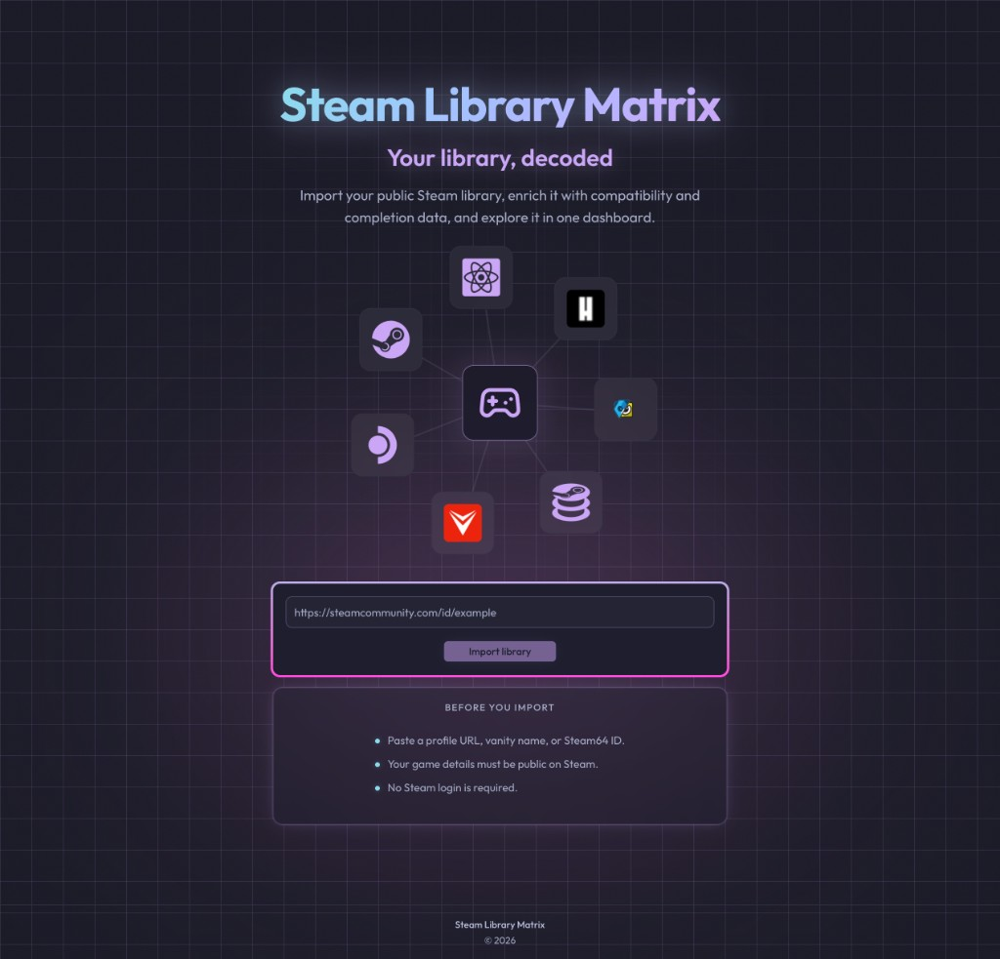
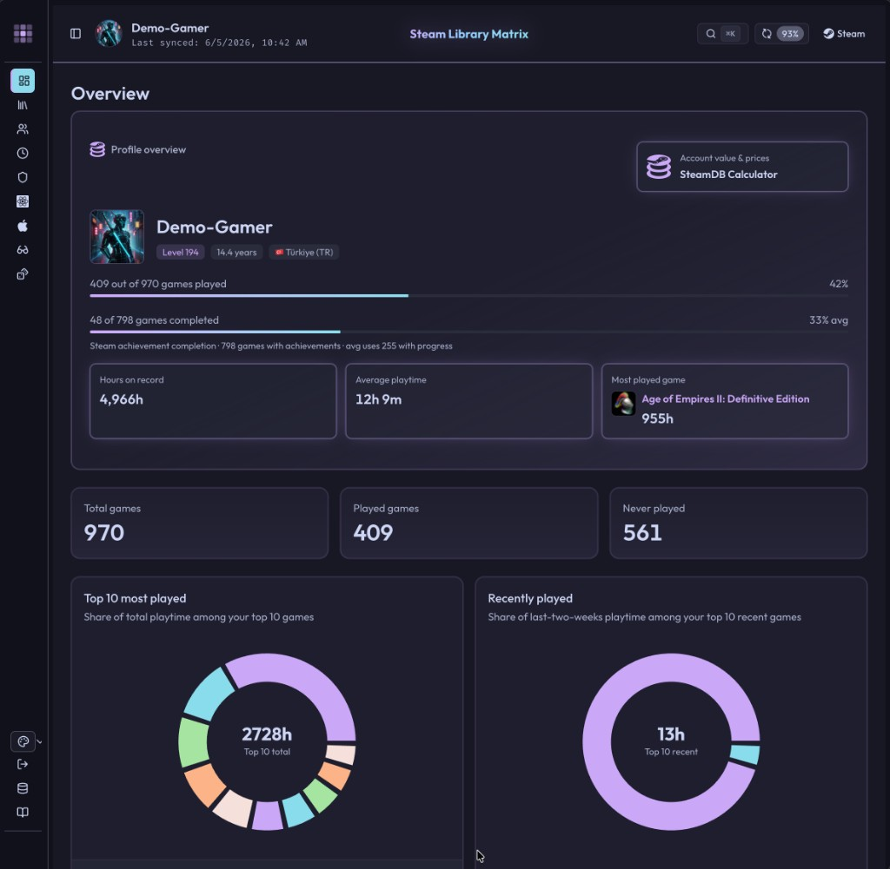
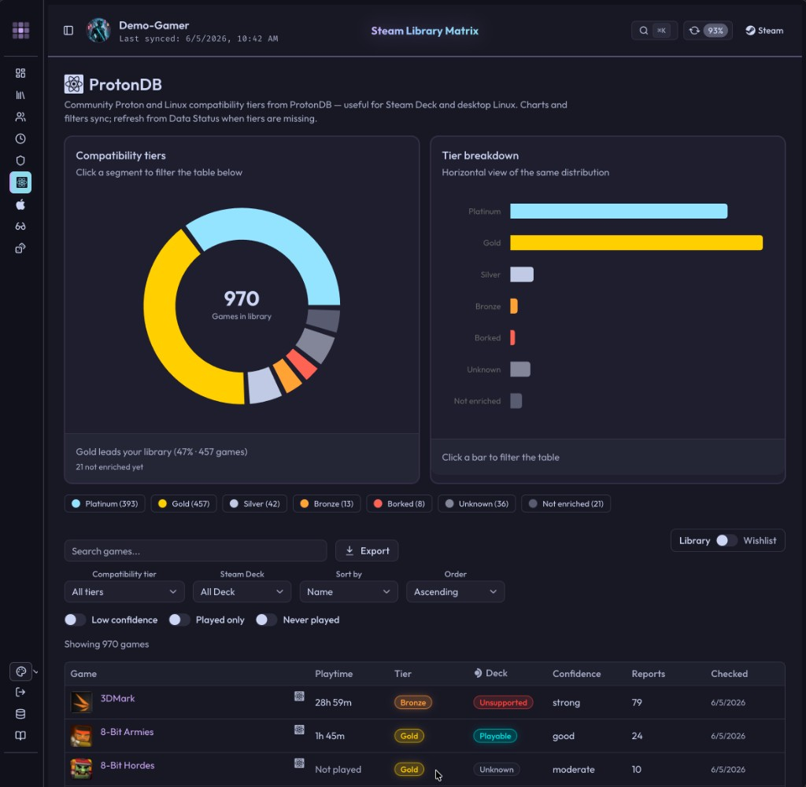

# Steam Library Matrix

**Your library, decoded.** Import a public Steam profile and explore it in one dashboard — Proton/Linux compatibility, anti-cheat & Denuvo status, how-long-to-beat, Steam Deck rating, Mac/VR support, achievements, and more.

**Self-hosted only** — no cloud database or hosted backend. The whole app is one Next.js process plus a single SQLite file.

> **New here?** [docs/architecture.md](docs/architecture.md) explains how it works end to end — import, the background enrichment queue, cross-source matching, and the bundled seed.

## Screenshots

| Landing | Overview |
| :---: | :---: |
|  |  |
| Paste a public profile URL, vanity name, or SteamID64 | Profile stats, quick metrics, and playtime distribution |

**ProtonDB compatibility**



## Features

- **Overview** — playtime, completion, and top-played / recently-played charts (plus an external SteamDB calculator link)
- **Library** — every owned game with OS-support icons, lifetime & recent playtime, search, filters (genre / OS / played / game vs DLC), sort, pagination, and CSV export
- **Achievements** — library-wide achievement progress with completion %, near-100%, and never-started filters
- **Genres** — store genre analytics: game counts and lifetime playtime per tag
- **ProtonDB** — Linux & Steam Deck compatibility tiers with a clickable distribution chart
- **HowLongToBeat** — main / main+extras / completionist times, with match confidence
- **Anti-Cheat** — Linux anti-cheat status (AWACY), kernel-level anti-cheat (Levvvel), and Denuvo signals
- **Mac & VR** — Apple Silicon (native), Rosetta 2, and CrossOver compatibility from AppleGamingWiki plus native macOS support; VR support / VR-only
- **Compare** — line up multiple profiles (intersection of libraries)
- **Backlog** — pile-of-shame stats, curated picks (quick wins, almost-there, gathering dust), a hand-picked queue with a monthly goal, and a random picker
- **Pluggable enrichment registry** — ProtonDB and HowLongToBeat run behind a shared `EnrichmentSource` contract ([docs/scraping.md](docs/scraping.md)); other sources still use legacy job steps
- **Global search** (⌘K / Ctrl+K), theme selector, and an About page with data sources & attribution

Enrichment fills in over time via a background worker; **Data Status** shows per-source progress and health.

## Tech stack

| Layer | Technologies |
| --- | --- |
| App | [Next.js](https://nextjs.org/) 16 (App Router), React 19, TypeScript |
| UI | Tailwind CSS 4, [shadcn/ui](https://ui.shadcn.com/) (Base UI), Lucide, Recharts |
| Data | SQLite ([better-sqlite3](https://github.com/WiseLibs/better-sqlite3)), [Drizzle ORM](https://orm.drizzle.team/), SQL migrations in `db/migrations/` |
| Enrichment | Steam Web API, ProtonDB API, HowLongToBeat, AWACY / Levvvel / Denuvo catalogs, AppleGamingWiki (macOS compatibility) (HTTP; Cheerio for some HTML sources) |
| Jobs | In-process enrichment worker (embedded in Docker; separate `dev:jobs` poller for local dev) |
| Testing | Vitest |
| Deploy | Node 22 + pnpm (local dev) · Docker + Docker Compose (self-host) |

## Choose how to run

| | Option 1 — Local Next.js | Option 2 — Docker Compose (recommended) |
| --- | --- | --- |
| **For** | Development, hot reload | Self-host on a server or LAN |
| **Requires** | Node 22, pnpm | Docker and Docker Compose only |
| **Config** | `.env` (repo root) | `docker/.env` |
| **Database** | `./data/matrix.db` | Docker named volume `matrix_db` |
| **Start** | `pnpm dev:all` | `docker compose -f docker/compose.yml up --build -d` |

Never commit `.env`, `docker/.env`, `data/*.db`, or `docker/db/*.db`.

## Get a Steam Web API key

Required for both options. A key is **required for import** — there is no optional slower mode without one. Each self-hoster registers and uses their **own** key; do not share keys across deployments.

1. Sign in at [https://steamcommunity.com/dev/apikey](https://steamcommunity.com/dev/apikey).
2. Register a new key. For **Domain Name**, use `localhost` (fine for LAN and self-host).
3. Copy the key into the env file for your chosen option (`STEAM_API_KEY=...`).
4. The Steam profile you import must be **public** (games visible on the profile).

---

## Option 1: Local Next.js

```bash
git clone https://github.com/atahan99/Steam-Library-Matrix.git
cd Steam-Library-Matrix

pnpm install
cp .env.example .env
```

Edit `.env`:

| Variable | What to set |
| --- | --- |
| `STEAM_API_KEY` | Key from above |
| `CRON_SECRET` | `openssl rand -hex 32` |

```bash
pnpm db:migrate
pnpm dev:all
```

Open [http://localhost:3000](http://localhost:3000). If Docker is already using port 3000, Next.js picks 3001.

Do **not** set `SLM_EMBED_JOB_WORKER` locally — `dev:all` runs the job worker. On pnpm 11 you may need `pnpm approve-builds better-sqlite3`.

---

## Option 2: Docker Compose

No Node or pnpm required on the host.

```bash
git clone https://github.com/atahan99/Steam-Library-Matrix.git
cd Steam-Library-Matrix

cp docker/.env.example docker/.env
```

Edit `docker/.env`:

| Variable | What to set |
| --- | --- |
| `STEAM_API_KEY` | Key from above |
| `CRON_SECRET` | `openssl rand -hex 32` |

The entrypoint creates `matrix.db` from the bundled template on first start — no manual copy step.

Start:

```bash
docker compose -f docker/compose.yml up --build -d
```

Open [http://localhost:3001](http://localhost:3001) (Docker uses **3001** so local dev can keep **3000**).

Check health:

```bash
curl -s http://localhost:3001/api/health
```

Expect `"ok":true` and `"steamApiKey":"ok"` before importing.

Stop or rebuild (data in the `matrix_db` volume is kept):

```bash
docker compose -f docker/compose.yml down
docker compose -f docker/compose.yml up --build -d
```

### Docker database

- Stored in the Compose named volume `matrix_db` at `/app/data/db` inside the container.
- Separate from local `./data/matrix.db`.
- Details: [docker/db/README.md](docker/db/README.md).

**Backup**:

```bash
docker compose -f docker/compose.yml exec app cp /app/data/db/matrix.db /tmp/matrix-backup.db
docker cp "$(docker compose -f docker/compose.yml ps -q app)":/tmp/matrix-backup.db ./matrix-backup.db
```

**Migrating an older database** (from a previous bind-mount layout into the `matrix_db` volume): see [docker/db/README.md § Migrate from bind mount](docker/db/README.md).

---

## First import

1. Paste a **public** profile URL, vanity name, or SteamID64 on the landing page.
2. You land on `/dashboard/[steamid]`.
3. **Refresh** re-syncs the library and queues enrichments; **Data Status** shows per-source progress.
4. Keep your chosen stack running so background jobs can finish.

Wishlist import needs a wishlist visible to the Steam Web API.

## Status & expectations

- Built for **single-user, self-hosted** use on a home machine or LAN — not a public multi-user service. Keep it on your LAN; [docs/security.md](docs/security.md) covers secrets, the CSP, and Docker hardening.
- Enrichment data is **best-effort**: it's aggregated from community sources via fuzzy name matching, so the occasional value will be missing or wrong. Confidence is shown where it matters (e.g. HowLongToBeat matches, Denuvo signals).
- Community sources can change without notice. When one breaks, the **Data Status** page surfaces it; a parser fix follows. Expect light, ongoing maintenance.

## Security

Secrets, rate limits, and CSP: [docs/security.md](docs/security.md). Env reference: [docs/env.md](docs/env.md#required).

## Scripts (local development)

| Command | Description |
| --- | --- |
| `pnpm dev:all` | Next.js + job worker |
| `pnpm dev` | Next.js only |
| `pnpm db:migrate` | Apply SQL migrations (local `./data/`) |
| `pnpm db:verify` | Verify schema |
| `pnpm seed:hydrate` | Load bundled seed metadata into SQLite |
| `pnpm seed:generate` | Regenerate `data/seed/` from local DB |
| `pnpm seed:verify` | Validate seed JSON files |
| `pnpm test` | Unit tests |
| `pnpm bootstrap` | Import + enrich via CLI |

Maintainers may use `pnpm docker:up` / `pnpm docker:down` as shortcuts for Compose; deployment docs use `docker compose` directly.

More tuning: [docs/env.md](docs/env.md).

## Planned

Not implemented yet — rough order, may change.

- [ ] Richer DLC — parent appid linkage and complete-edition views beyond the library game/DLC filter
- [ ] First *new* source on the enrichment registry (e.g. PCGamingWiki, player counts, or review scores)
- [ ] Publish a prebuilt image to GHCR

Intentionally external (not planned in-app): SteamDB calculator (Overview link only) and price/deals data.

## Documentation

- [docs/README.md](docs/README.md) — index and reading order
- [docs/architecture.md](docs/architecture.md) — how the system works (overview + deep dives)
- [docs/self-hosting.md](docs/self-hosting.md) — Docker hardening, TLS, proxy
- [docs/env.md](docs/env.md) — environment variables
- [docs/database.md](docs/database.md) — SQLite, migrate, backup
- [docs/scraping.md](docs/scraping.md) — data sources and enrichment
- [docs/security.md](docs/security.md) — open routes, rate limits, CSP, secrets

## License

[MIT](LICENSE)
