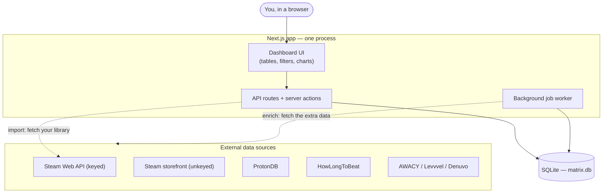
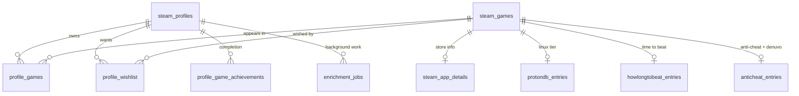
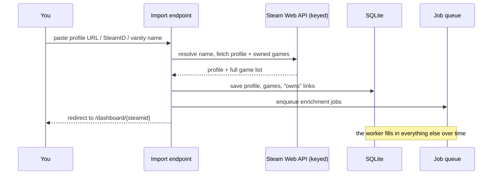
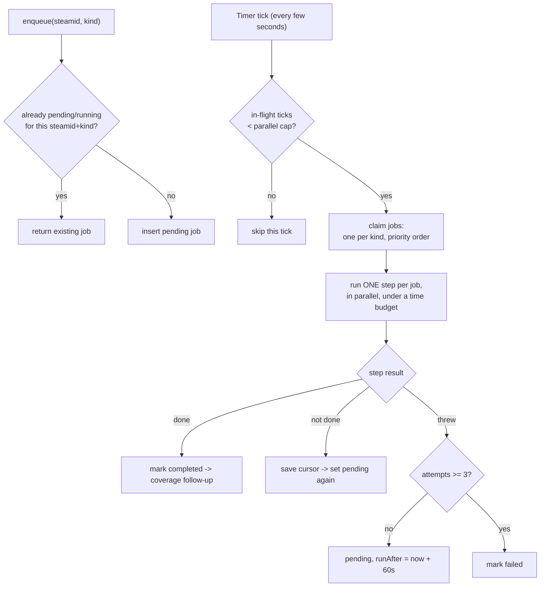
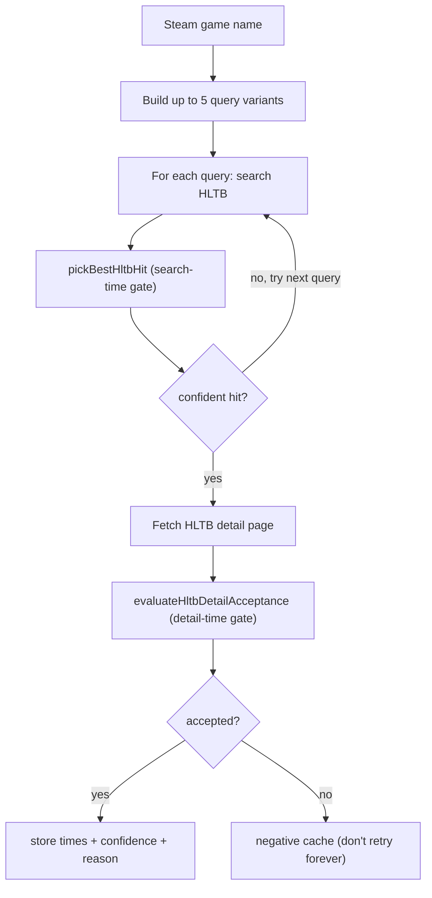
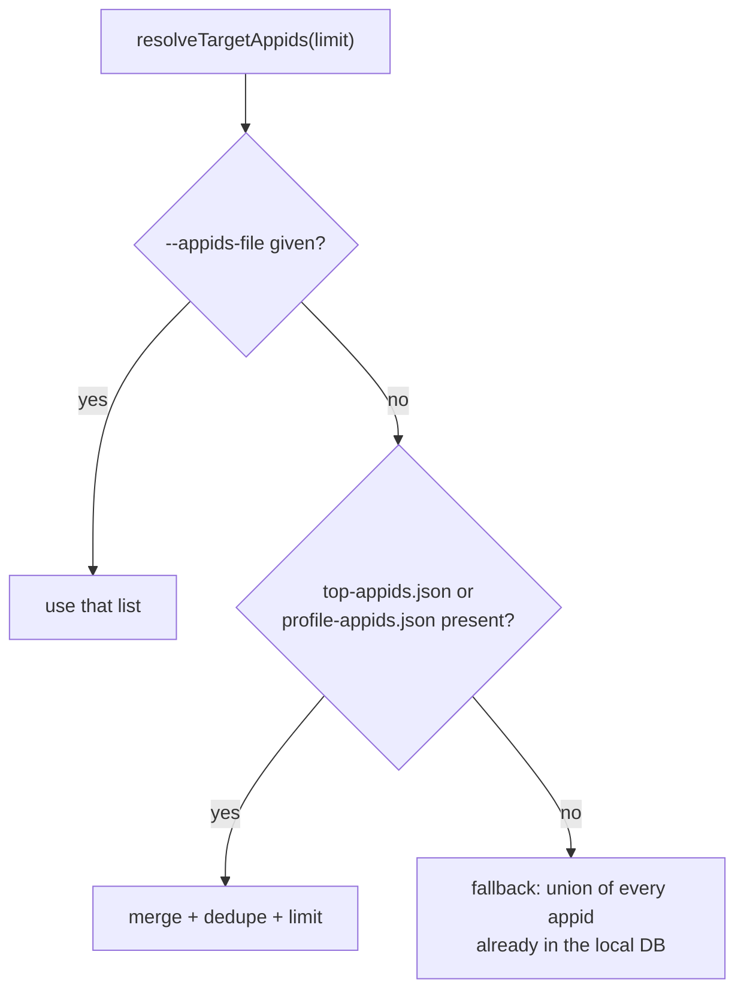
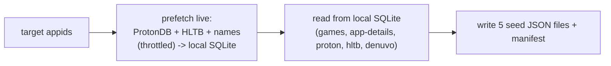
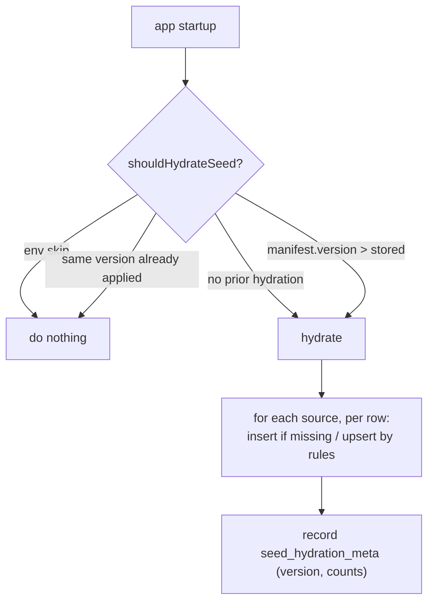
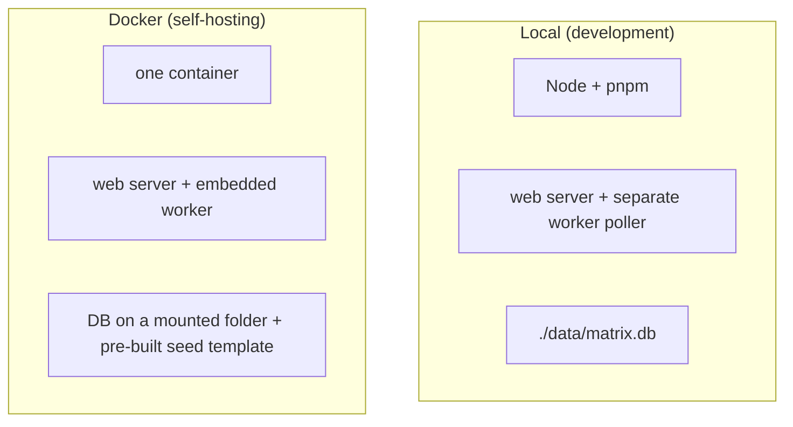

# Architecture

**Steam Library Matrix** is a self-hosted web dashboard that imports a public Steam
library and layers on data Steam doesn't surface in one place — Proton/Linux
compatibility, anti-cheat and Denuvo status, "how long to beat," Steam Deck rating,
Mac/VR support, and achievements — then lets you search, filter, sort, and compare
across all of it.

It is **self-hosted only**: there is no cloud database or hosted backend. The entire
runtime is one Next.js process plus a single SQLite file.

This document explains how the system is put together and how data flows through it.
For setup and operations see [`README.md`](../README.md) and the other files in
[`docs/`](./README.md).

---

## Table of contents

1. [Design principles](#1-design-principles)
2. [Tech stack](#2-tech-stack)
3. [System overview](#3-system-overview)
4. [Data sources](#4-data-sources)
5. [Data model](#5-data-model)
6. [Core workflows](#6-core-workflows)
7. [Deep dive: the job worker](#7-deep-dive-the-job-worker)
8. [Deep dive: matching logic](#8-deep-dive-matching-logic)
9. [Deep dive: the seed system](#9-deep-dive-the-seed-system)
10. [Running it: local vs Docker](#10-running-it-local-vs-docker)
11. [Security model](#11-security-model)
12. [File map](#12-file-map)

---

## 1. Design principles

A few ideas recur throughout the codebase and explain most of its structure:

- **The UI never waits on the slow internet.** Page loads read everything from local
  SQLite and are instant. All slow, rate-limited, failure-prone external fetching is
  pushed into a background worker.
- **Separate "your data" from "the extra data."** Importing a library is fast (one or
  two Steam calls). Enriching it is the slow part, handled asynchronously.
- **Graceful degradation.** If a third-party source breaks or is down, that game simply
  shows no value for that column — the dashboard always loads. Nothing external can take
  the page down.
- **Durable, resumable work.** Background jobs live as rows in SQLite with saved progress
  cursors, so a restart resumes exactly where it stopped; nothing is lost.
- **Honest about uncertainty.** Cross-source matching is fuzzy, so the app records *how*
  a match was made and how confident it was, and the UI reflects that.
- **Useful on day one.** A bundled "seed" dataset pre-populates popular games so a fresh
  install isn't empty, while live enrichment improves and personalizes it over time.

---

## 2. Tech stack

| Layer | Technologies |
| --- | --- |
| App framework | Next.js 16 (App Router), React 19, TypeScript |
| UI | Tailwind CSS 4, shadcn/ui (Base UI), Lucide icons, Recharts |
| Database | SQLite (`better-sqlite3`), Drizzle ORM, hand-written SQL migrations in `db/migrations/` |
| Background work | In-process enrichment worker (embedded in Docker; a poller drives it locally) |
| External data | Steam Web API, Steam storefront, ProtonDB, HowLongToBeat, AWACY / Levvvel / Denuvo |
| Testing | Vitest (network tests isolated as `*.live.test.ts`) |
| Packaging | Node 22 + pnpm (local), Docker + Docker Compose (self-host) |

---

## 3. System overview

The whole application is **one process** plus **one database file**. The web UI, the API
routes/server actions, and the background worker all live inside the same Next.js
runtime and talk to the same SQLite database.



Two structural facts follow from this:

1. Reads (dashboard) come straight from SQLite — fast and offline-capable.
2. Writes from external sources are funneled through the worker, which controls
   concurrency, freshness (TTLs), and rate limiting.

---

## 4. Data sources

Each game is enriched from several independent sources, each answering one question:

| Source | Provides | Access |
| --- | --- | --- |
| **Steam Web API** (`api.steampowered.com`) | Owned games, playtime, profile, achievements, wishlist | Official, **keyed** (`STEAM_API_KEY`), ~100k calls/day |
| **Steam storefront** (`store.steampowered.com`) | Genres, categories, platforms, release date, **Steam Deck** rating, **Denuvo** notices | Unofficial, **unkeyed**, throttled ~200 req / 5 min per IP, bans on abuse |
| **ProtonDB** | Linux compatibility tier (platinum…borked) | Public API |
| **HowLongToBeat** | Time to beat (main / extras / completionist) | Scraped (no API) |
| **AreWeAntiCheatYet (AWACY)** | Whether anti-cheat works on Linux | Community catalog |
| **Levvvel** | Whether a game uses kernel-level anti-cheat | Community catalog |
| **Denuvo** (curator + store pages) | Denuvo anti-tamper DRM presence | Curator list + store-page text |

> **Keyed vs unkeyed — important.** The two Steam hosts are different services. The
> **Web API** is keyed and generous. The **storefront** ignores keys entirely and limits
> by IP; it is the source of rate-limit bans. The richer store fields (categories,
> platforms, Deck rating, Denuvo) exist *only* on the unkeyed storefront, so they must be
> throttled rather than authenticated. See [`docs/scraping.md`](./scraping.md).

```
                         ┌─ Steam Web API ──→ library, playtime, achievements, wishlist
                         ├─ Steam storefront → genres, platforms, Deck rating, Denuvo
   One game (appid) ─────┼─ ProtonDB ───────→ Linux compatibility tier
                         ├─ HowLongToBeat ──→ time to beat
                         ├─ AWACY ──────────→ Linux anti-cheat status
                         ├─ Levvvel ────────→ kernel anti-cheat
                         └─ Denuvo ─────────→ anti-tamper DRM
```

---

## 5. Data model

A game is stored **once** (`steam_games`); each source gets its own table keyed by
`appid`. Profiles connect to games through "library" and "wishlist" link tables. Shared
catalogs (AWACY, Levvvel, Denuvo) are fetched once globally rather than per game.



| Table | Purpose |
| --- | --- |
| `steam_profiles` | Imported profiles (persona, avatar, level, country, sync timestamps) |
| `steam_games` | One row per app (name, icon, store URL) |
| `profile_games` | Library link: which profile owns which app + playtime (composite PK) |
| `profile_wishlist` | Wishlist link (composite PK) |
| `steam_app_details` | Storefront details: type, genres, categories, platforms, release, Deck rating |
| `protondb_entries` | ProtonDB tier, confidence, report counts |
| `howlongtobeat_entries` | Beat times + matched name + match confidence |
| `anticheat_entries` | AWACY status, Levvvel kernel flag, Denuvo fields (per game) |
| `profile_game_achievements` | Per profile/game completion (composite PK) |
| `enrichment_jobs` | The background job queue (see §7) |
| `data_refresh_log` | Per-source refresh history for the UI |
| `awacy_catalog`, `levvvel_kernel_catalog`, `denuvo_anti_tamper_catalog` | Global source catalogs |
| `anticheat_catalog_meta` | Catalog sync status/row counts |
| `seed_hydration_meta` | Which bundled seed version has been applied (see §9) |

Foreign keys cascade on delete (deleting a profile removes its library/wishlist/jobs),
and the schema is defined in `src/lib/db/schema/index.ts` with matching SQL in
`db/migrations/`.

---

## 6. Core workflows

### 6.1 Importing a profile

Fast path. You paste a profile URL, vanity name, or SteamID; within seconds you're
looking at your library.



Input parsing (`src/lib/steam/parse-steam-input.ts`) only extracts a SteamID or vanity
name via regex — it never fetches a user-supplied URL, which keeps the import endpoint
free of SSRF risk. Import logic is in `src/lib/steam/import-library.ts`.

### 6.2 Background enrichment

The slow work. A SQLite-backed job queue is drained by a worker that processes jobs in
priority order, in resumable chunks bounded by a time budget. Covered in depth in
[§7](#7-deep-dive-the-job-worker).

### 6.3 Viewing and filtering

On a dashboard request, the server reads the full library + wishlist + every enrichment
table, stitches them into one combined list (`DashboardGame[]`), and sends it to the
browser. From there **all filtering, sorting, searching, and pagination happen
client-side**, with the active view encoded in the URL (shareable, back-button-friendly).

Server assembly lives in `src/lib/db/dashboard.ts` (`fetchDashboardPayload`), the join
query in `src/lib/db/load-steam-game-join-rows.ts`, and row mapping in
`src/lib/db/map-dashboard-game.ts`. Pages include Overview, Library, ProtonDB,
HowLongToBeat, Anti-cheat, Mac, VR, Compare, Random Picker, Data Status, and About.

### 6.4 Seeding

A bundled dataset for ~2,200 popular games is hydrated into SQLite on startup so the
dashboard isn't empty on first run. Covered in depth in [§9](#9-deep-dive-the-seed-system).

### One enrichment path

All enrichment is triggered the same way: the UI (and post-import / full-sync) **enqueues
jobs** via `POST /api/jobs`, and the background worker drains them. There is a single
execution path — the worker and its per-source steps (`enrichSingle*` primitives reused by
each batch step). An earlier synchronous server-action refresh path was removed; because
`/api/jobs` is open, the queue works whether or not the API guard is configured.

---

## 7. Deep dive: the job worker

### The problem

Enriching a library means thousands of slow, rate-limited HTTP calls. That can't happen
in a web request (timeouts), can't happen all at once (bans), and can't lose progress on
restart. The worker is a small **durable queue built inside SQLite** that handles all
three.

### Vocabulary

There are 8 **job kinds**, each with a priority (lower runs first):

| Priority | Kinds | Notes |
| --- | --- | --- |
| 0 | `anticheat_catalog`, `denuvo_catalog` | global catalogs — everything else depends on them |
| 1 | `wishlist` | |
| 2 | `achievements` | |
| 3 | `anticheat` | per-game anti-cheat + Denuvo matching |
| 4 | `protondb`, `app_details` | |
| 5 | `hltb` | slowest / most fragile, runs last |

A job row carries a `payload` (target appids, a `cursor`, accumulated `stats`, flags like
`force`/`missingOnly`, and an `anticheatPhase`) and a `progress` snapshot the UI polls.

### Lifecycle



**Enqueue + dedup** (`src/lib/jobs/enqueue.ts`). Before inserting, it returns any existing
`pending`/`running` job of the same `(steamid, kind)` — so mashing "Refresh" never piles
up duplicates. A partial unique index in the database (`enrichment_jobs_one_active_per_kind`)
enforces the same rule even under a race.

**Scheduling + parallel ticks** (`src/lib/jobs/worker-tick-scheduler.ts`). A timer fires
`scheduleEnrichmentWorkerTick()`, which is fire-and-forget but caps concurrent ticks at
`SLM_WORKER_PARALLEL_TICKS` (default 4). That cap is what allows ticks to overlap during
network waits without unbounded concurrency. In Docker the worker is embedded via
`src/instrumentation.ts` (`SLM_EMBED_JOB_WORKER=true`); locally a poller / cron route
drives it.

**Claiming — atomic + fair** (`src/lib/jobs/worker.ts`). Each claim is a DB transaction:
select the highest-priority pending job whose `runAfter <= now`, then update it to
`running` with a lock (`lockedBy`, `lockedAt`). Doing select+update in one transaction is
what makes it safe across processes — two workers can't grab the same row. A tick claims
**at most one job per kind**, so a 5,000-game ProtonDB job can't starve `app_details` —
every kind gets a turn each tick.

**Stepping — cursor + budget + concurrency** (`src/lib/jobs/run-step.ts`). A step doesn't
process a whole library; it processes a **slice**: from `cursor`, take `BATCH` items, and
run them through `runConcurrentBatch` (`src/lib/jobs/run-concurrent-batch.ts`) — N
concurrent workers, each checking the wall-clock deadline before starting another, with an
optional stagger between items.

```
   appids: [ ............ 5000 items ............ ]
              ^cursor=0        ^batch (e.g. 50)
   tick 1 -> process 50 concurrently, save cursor=50, status=pending
   tick 2 -> cursor 50..100 ...
   ...
   tick N -> cursor >= total -> status=completed
```

A step is bounded by **both** a batch size and a wall-clock deadline
(`SLM_WORKER_TICK_BUDGET_MS`, default ~50s). It returns "done" (cursor reached the end) or
"not done" with the advanced cursor saved back into the payload; a killed process resumes
from that cursor. Accumulated `stats` are merged across ticks so progress is continuous.

**Completion, retry, stale locks.**

- *Done* → mark `completed`, then run a coverage follow-up (below).
- *Not done* → back to `pending` with the new cursor, run again next tick.
- *Threw* → if `attempts < 3`, back to `pending` with `runAfter = now + 60s` (backoff); at
  3 attempts, mark `failed`.
- *Crashed mid-run* → `releaseStaleRunningJobs` resets any `running` job whose lock is
  older than 10 minutes back to `pending`. Self-healing.

**Coverage follow-ups** (`src/lib/jobs/enqueue-coverage-followup.ts`). When a batched job
finishes it checks for gaps: failures trigger a `missingOnly` retry; `app_details` /
`protondb` re-resolve what's still missing and queue a gap-fill; `denuvo_catalog`
re-queues if still incomplete. The system converges toward full coverage on its own.

**Two-phase anti-cheat.** The `anticheat` job runs `phase: "catalog"` first (match every
game against the in-memory AWACY/Levvvel catalogs — fast, no per-game network), and when
that cursor completes it flips to `phase: "denuvo"` (the slow, throttled store-page scrape)
by resetting the cursor and continuing as the *same* job. One job, two passes, fast data
first.

---

## 8. Deep dive: matching logic

### Why it's hard

Community sources key their data by **game name**, and names never line up: Steam has
`ELDEN RING™`, HowLongToBeat has `Elden Ring`, a catalog might have
`Elden Ring: Shadow of the Erdtree`. Every source needs a matcher, and they range from
simple to quite involved.

The shared foundation is **`normalizeGameName`** (`src/lib/utils/normalize-game-name.ts`):
lowercase → strip `™®©:` → strip non-alphanumerics → collapse whitespace. This canonical
form is the key for all exact-match lookups.

### Matcher A — Denuvo (signal fusion → display state)

Two stages. First **score** (`src/lib/steam/denuvo/score-denuvo-status.ts`) fuses two
independent signals — store-page DRM notices and the Denuvo-Watch curator listing:

```
store says "Denuvo Anti-Tamper"               -> true,  HIGH   (store_page)
store says Denuvo "removed"                    -> false, HIGH   (removal_confirmed)
store checked, no Denuvo, but curator lists it -> true,  MEDIUM (curator)
only curator lists it (store unchecked)        -> true,  MEDIUM (curator)
neither                                        -> null,  NONE
```

Then **display resolution** (`src/lib/steam/denuvo/resolve-denuvo-display-state.ts`) maps
the stored fields to a UI state:

| Stored | Display |
| --- | --- |
| true + high | **Denuvo detected** |
| true + medium/low | **Possible Denuvo** |
| false + high + store/removal | **No active Denuvo confirmed** |
| anything else | **DRM status unknown** |

Notably, a `false` only becomes "confirmed absent" with a high-confidence store signal;
otherwise it degrades to "unknown" rather than over-claiming, and every tooltip carries a
disclaimer that Steam doesn't reliably expose third-party DRM.

### Matcher B — anti-cheat (3-tier name match + cross-reference)

Catalogs are loaded into indexes once (`src/lib/anticheat/anticheat-indexes.ts`): a
`bySteamAppId` map, a `byName` map (both O(1)), and a flat array for fuzzy fallback.
Matching (`src/lib/anticheat/match-from-indexes.ts`) walks three confidence tiers:

```
1. Steam app ID match    -> confidence "appid"        (ground truth)
2. Exact normalized name -> confidence "exact-title"
3. Fuzzy (Levenshtein >= 0.85 over all entries) -> "fuzzy-title"
   else -> "none"
```

AWACY (Linux status) and Levvvel (kernel anti-cheat) are matched independently then merged;
a result is persisted only if it's "meaningful" (real status, named anti-cheats, or a
definite kernel yes/no).

### Matcher C — HowLongToBeat (the sophisticated one)

A two-gate pipeline. HLTB has no API and messy names, but its search results often embed
the game's own Steam app ID, which is ground truth when present.



**Query variants** (`resolveHltbSearchQueries` in `src/lib/enrichment/hltb-match.ts`): the
full cleaned name, the edition-stripped name, the part before a subtitle colon, the "base
title" (with ~50 edition stopwords like *definitive, goty, remastered, redux* removed), and
the base title without a leading "the". Tries them in order, stops at the first confident
hit.

**Search-time gate** (`pickBestHltbHit`), tiered:

1. A hit whose embedded Steam ID equals the app → **confidence 1** (definitive).
2. Exact normalized name → 1.
3. Equal base title → ≥ 0.82.
4. Else the best-scoring hit: `nameSimilarity·0.65 + tokenOverlap·0.35 + 0.15 baseBoost`,
   penalized ×0.4 if the hit links a *different* Steam ID, ×0.75 if both overlap and
   similarity are weak; ties break toward more community data. Must clear 0.55.

**Detail-time gate** (`evaluateHltbDetailAcceptance`), with thresholds that vary by
evidence quality:

| Evidence | Threshold | Result |
| --- | --- | --- |
| detail's Steam ID == appid | — | accept (confidence 1, `steam_id`) |
| edition variant (bases align, extras are all stopwords) | — | accept (`edition_variant`) |
| equal base title **and** search confidence ≥ 0.62 | 0.62 | accept (`base_title`) |
| detail links a *different* Steam ID | — | **reject** (mismatch) |
| name only | ≥ 0.72 | accept (`search_confidence`) |

It trusts HLTB's embedded Steam ID as ground truth, falls back to edition-aware name logic,
and demands higher confidence when name is the only evidence. Rejections are negative-cached
so the worker stops re-attempting them.

The throughline across all three matchers: prefer an exact ID, then exact name, then
increasingly cautious fuzzy logic — and always record how the match was made and how
confident it was.

---

## 9. Deep dive: the seed system

### Why it exists

A blank database would show an empty library until the worker slowly caught up, and would
make every install re-scrape the same popular games. The seed ships **pre-computed data
for ~2,200 popular games** so the dashboard is useful immediately, and (in Docker) so a new
container is populated with zero runtime work.

### Choosing which games to seed

`src/lib/seed/resolve-target-appids.ts` picks the appid set, in order:



`top-appids.json` is scraped from Steam's top sellers; `profile-appids.json` is exported
from real libraries. A helper can even reconstruct the target list from the bundled seeds
when the live top-sellers fetch is unavailable, so generation never hard-fails.

### Generating the seed (a maintainer task)



`pnpm seed:generate` (`scripts/generate-seed-metadata.ts`) first live-fetches ProtonDB +
HLTB into the local DB (`src/lib/seed/prefetch-seed-enrichment.ts`, throttled), then exports
whatever the local DB now knows. The key mental model: **the seed is a snapshot of a
well-enriched local database.**

| File | Contents |
| --- | --- |
| `steam-games.seed.json` | appid → name / icon / store URL |
| `protondb.seed.json` | Linux tier + report counts |
| `hltb.seed.json` | beat times + matched name |
| `denuvo.seed.json` | Denuvo anti-tamper + confidence |
| `app-details-lite.seed.json` | header image / genres / platforms / Deck / release |
| `metadata-manifest.json` | version + per-source counts |

### Hydrating on startup



**Version gate** (`src/lib/seed/should-hydrate-seed.ts`): hydration re-runs only when the
bundled `manifest.version` is **greater** than the value recorded in `seed_hydration_meta`.
Therefore **any change to seed content must bump `SEED_MANIFEST_VERSION`** in
`src/lib/seed/types.ts`, or existing installs silently ignore it. Loading is fail-safe —
`src/lib/seed/load-seed-files.ts` zod-validates every file and tolerates missing optional
ones, collecting warnings instead of throwing.

**Upsert rules** (`src/lib/seed/upsert-rules.ts`) embody the principle that the seed is a
starting point, never an authority:

- `shouldApplySeedTimestamp` — apply a seed row only if its `checkedAt` is newer than the
  existing row's `lastCheckedAt`, so freshly-fetched live data is never clobbered by older
  bundled data.
- `shouldApplySeedDenuvoRow` — never overwrite live Denuvo data that is newer or
  higher-confidence than the seed.
- When hydrating Denuvo into an anti-cheat row that has no AWACY data yet, it sets
  `lastCheckedAt = null` to deliberately mark the row as still needing the live AWACY pass.

### The Docker fast-path

`scripts/build-docker-db-template.ts` runs migrate + hydrate into a throwaway DB at *build*
time and saves it as `docker/db/matrix.db.template`, baked into the image. On first start
the entrypoint copies it in, so the container's database is fully seeded with no runtime
hydration cost.

---

## 10. Running it: local vs Docker



- **Local** is for development and hot reload: run the web app plus a small poller that
  drives the worker (`pnpm dev:all`). Do **not** set `SLM_EMBED_JOB_WORKER` locally.
- **Docker** is the intended self-host target: a single container with the worker embedded
  (`SLM_EMBED_JOB_WORKER=true`) and a pre-seeded database ready on first boot.

Both require a free **Steam Web API key**, and the imported profile must be public. Tuning
knobs (batch sizes, concurrency, intervals, rate limits) are environment variables — see
[`docs/env.md`](./env.md).

---

## 11. Security model

For a self-hosted app the defaults aim to be safe on a home LAN and hardenable for the
public internet (see [`docs/security.md`](./security.md)):

- **Security headers + CSP** (`src/proxy.ts`, `src/lib/security/csp.ts`): nonce-based
  Content-Security-Policy with `strict-dynamic`, plus `X-Frame-Options`, `X-Content-Type-Options`,
  `Referrer-Policy`, `Permissions-Policy`, and HSTS in production.
- **Rate limiting** (`src/lib/api/rate-limit.ts`): per-IP, tiered (default vs expensive
  endpoints).
- **Input validation**: request bodies are validated with zod; Steam input parsing extracts
  only an ID/vanity (no SSRF surface).
- **Cron auth** (`/api/cron/process-jobs`): requires `CRON_SECRET`. All other API routes are open (rate-limited); use a reverse proxy for public exposure.

---

## 12. File map

Quick reference to the main pieces described above:

| Area | Key files |
| --- | --- |
| Database client / schema | `src/lib/db/client.ts`, `src/lib/db/schema/index.ts`, `db/migrations/` |
| Dashboard read path | `src/lib/db/dashboard.ts`, `src/lib/db/load-steam-game-join-rows.ts`, `src/lib/db/map-dashboard-game.ts` |
| Job worker | `src/lib/jobs/worker.ts`, `run-step.ts`, `run-concurrent-batch.ts`, `enqueue.ts`, `worker-tick-scheduler.ts`, `enqueue-coverage-followup.ts`, `batch-config.ts` |
| Enrichment resolution / TTL | `src/lib/enrichment/resolve-enrichment-appids.ts` |
| Steam APIs | `src/lib/steam/steam-api.ts` (keyed), `steam-store.ts` / `steam-store-fetch.ts` / `fetch-steam-deck-compatibility.ts` (storefront) |
| ProtonDB / HLTB | `src/lib/enrichment/protondb.ts`, `src/lib/enrichment/hltb-client.ts`, `src/lib/enrichment/hltb-match.ts` |
| Anti-cheat / Denuvo | `src/lib/anticheat/*`, `src/lib/steam/denuvo/*` |
| Seed system | `src/lib/seed/*`, `scripts/generate-seed-metadata.ts`, `scripts/build-docker-db-template.ts` |
| Security / env | `src/proxy.ts`, `src/lib/security/csp.ts`, `src/lib/api/*`, `src/lib/env/runtime-env.ts` |
| Startup / worker embed | `src/instrumentation.ts` |

---

*This document describes the architecture as built; for planned work see the "Planned"
section of [`README.md`](../README.md).*
