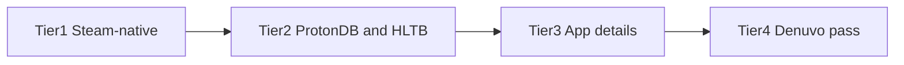

# Scraping and HTTP data sources

Server-side data uses public APIs, `fetch`, and HTML parsing where needed. **No browser automation** in the app.

## Two Steam APIs (do not confuse them)

| API | Host | Auth | Limits | Used for |
| --- | --- | --- | --- | --- |
| **Steam Web API** | `api.steampowered.com` | Keyed (`STEAM_API_KEY`) | ~100k calls/day per key | Owned games, profiles, achievements, wishlist, **GetAppList** name lookup |
| **Steam storefront** | `store.steampowered.com` | **Unkeyed** (no `key=` param) | ~200 req / 5 min **per IP**; 403 = ban | `appdetails`, Deck compat AJAX, store HTML (Denuvo) |

Attaching `STEAM_API_KEY` to storefront URLs does nothing. Storefront calls share a **SQLite-backed rate gate** (`steam_store_throttle`) so every process (dev server, `dev:jobs`, `seed:generate`) coordinates on one gap and one circuit breaker. Tune gap with `SLM_STEAM_STORE_GAP_MS` (default ~2000ms). A 403 or exhausted 429 trips a persistent cooldown (30m → 60m → 120m); all storefront work stops until it expires.

### Switching IP (hotspot / new network)

Steam bans are **per public IP**. The app cooldown is **local SQLite** — it stays active even after you change networks. Before resuming storefront scans on a fresh IP:

```bash
pnpm store:throttle          # inspect cooldown_until / consecutive_blocks
pnpm store:reset-throttle    # clear local gate (does not touch enrichment cache)
SLM_STEAM_STORE_GAP_MS=2500 pnpm seed:generate --verbose
```

Stop dev server / `dev:jobs` while bulk-generating so only one process hits the store. Keyed Web API calls (`GetAppList`, owned games) are unaffected by storefront cooldown.

## What we fetch

| Data | How it is loaded |
| --- | --- |
| Library / wishlist / achievements | Steam Web API (`STEAM_API_KEY`) |
| Windows / Linux / native Mac flag | Steam store app details → `platforms.*` |
| macOS: Apple Silicon / Rosetta 2 / CrossOver | AppleGamingWiki Cargo API (fuzzy name match) |
| ProtonDB | ProtonDB API |
| HowLongToBeat | HLTB client |
| AWACY anti-cheat | Public JSON |
| Levvvel kernel list | `fetch` + HTML parse |
| Denuvo anti-tamper catalog | Steam Store curator AJAX |
| SteamDB calculator | **External link** on Overview — no server scrape ([`calculator-url.ts`](../src/lib/steamdb/calculator-url.ts)) |

The Library OS icons use **`platforms.mac`** from app details. The **Mac page** is a separate source: AppleGamingWiki's macOS compatibility table (Apple Silicon native / Rosetta 2 / CrossOver ratings), matched to your library by name — see [Global catalogs](#global-catalogs-awacy--levvvel--denuvo) and [Global vs per-appid](#global-vs-per-appid).

## Platforms in your library

**App details** run after import/refresh (`app_details` job), from Data Status, or `pnpm bootstrap`. Stores `platforms.windows`, `platforms.linux`, `platforms.mac`.

- **Library** OS column: app details only (`platforms.windows/linux/mac`)
- **Mac Support** page: AppleGamingWiki ratings (Apple Silicon / Rosetta 2 / CrossOver), defaulting to games found in the AppleGamingWiki database; the native Mac flag (`platforms.mac`) is shown alongside

Needs `STEAM_API_KEY` and `DATABASE_URL` only.

## Global catalogs (AWACY / Levvvel / Denuvo)

**Instance-wide** tables, not per profile. Filled automatically on a fresh DB:

- **Docker:** after migrate, [`docker/entrypoint.sh`](../docker/entrypoint.sh) → `bootstrap-anticheat-catalogs.ts`
- **Server start:** [`instrumentation.ts`](../src/instrumentation.ts) if still empty
- **After import:** background bootstrap if missing

Manual refresh: Data Status. Disable auto: `SLM_SKIP_CATALOG_BOOTSTRAP=true`.

Denuvo catalog: [`fetch-denuvo-curator-catalog.ts`](../src/lib/steam/fetch-denuvo-curator-catalog.ts) via `ajaxgetcuratorrecommendations`.

The **AppleGamingWiki macOS catalog** (`macos_compat_catalog`) is bootstrapped the same way (`src/lib/mac/`): pulled from the AppleGamingWiki Cargo API, then name-matched into per-app `macos_compat_entries` after each import (`rematchMacosCompatEntries`). Refresh from Data Status.

## Bundled seed metadata

**First-launch performance:** compact derived metadata in [`data/seed/`](../data/seed/) is hydrated into SQLite before live scraping runs.

| File | Contents |
| --- | --- |
| `top-appids.json` | Steam store top sellers (up to 5000 appids) — target list for seed export |
| `metadata-manifest.json` | version, counts, generatedAt |
| `steam-games.seed.json` | appid, name, icon/store basics |
| `denuvo.seed.json` | Denuvo status, confidence, source, evidence |
| `app-details-lite.seed.json` | app details: genres, categories, platforms, Deck rating, release (no long descriptions) |
| `protondb.seed.json` | ProtonDB tier, confidence, reports, checkedAt |
| `hltb.seed.json` | HLTB durations, match metadata, negative-cache rows |
| `macos-compat.seed.json` | AppleGamingWiki macOS catalog (native/Rosetta/CrossOver) + name-matched per-app entries |

Flow: migrate → **seed hydrate** → catalog bootstrap → background enrichment for missing/stale/low-confidence rows.

Refresh top sellers: `pnpm seed:fetch-top-appids`. Regenerate (includes live ProtonDB/HLTB prefetch): `pnpm seed:generate`. Export-only: `pnpm seed:generate --skip-prefetch`. Disable: `SLM_SKIP_SEED_HYDRATION=true`.

**Attribution:** Bundled seed JSON is derived metadata from Steam (Web API + storefront), ProtonDB, HowLongToBeat, AWACY, Levvvel, and the Denuvo Watch curator. Steam Library Matrix does not claim ownership — rights remain with the original sources. The About page lists each provider and a data-provenance note for end users.

**Generate seed metadata slowly and resumably.** A full ~2200-appid prefetch takes hours at the storefront rate limit. If Steam trips a cooldown, `seed:generate` stops cleanly, leaves partial rows in SQLite, and you re-run the same command later — TTL skips already-fresh appids. Prefer running bulk generation from a dedicated machine/IP or across several days. Name resolution uses keyed **GetAppList** (not storefront) for most appids; storefront `appdetails` is only a fallback.

### GetItems spike (future bulk appdetails)

Investigation script: `pnpm tsx --env-file=.env scripts/spike-store-getitems.ts` → [`docs/getitems-spike-report.md`](./getitems-spike-report.md).

`IStoreBrowseService/GetItems` on `api.steampowered.com` is batchable and keyed — a possible replacement for per-app storefront `appdetails` during seed generation. **Not migrated yet.** Deck compatibility and Denuvo store-page HTML have **no** keyed equivalent and must stay on the throttled storefront path.

**Denuvo is confidence-based:** absence from the curator list or store DRM section does **not** mean “no Denuvo”. The UI shows detected / possible / unknown / confirmed absent (explicit removal only). High-confidence seed data is treated as fresh for ~30 days before store re-check.

## Global vs per-appid

| Layer | Tables | Scope |
| --- | --- | --- |
| **Global catalogs** | `awacy_catalog`, `levvvel_kernel_catalog`, `denuvo_anti_tamper_catalog`, `macos_compat_catalog` | One copy for the whole instance |
| **Per-appid cache** | `steam_app_details`, `protondb_entries`, `howlongtobeat_entries`, `anticheat_entries`, `macos_compat_entries`, `profile_game_achievements` | Keyed by **appid** (achievements by `steamid`+`appid`), shared across profiles |

Jobs enqueue only for **your** profile’s appids (or compare warmup scope). If two profiles own appid `570`, the second reuses cached rows within TTL. Targets resolved in [`resolve-enrichment-appids.ts`](../src/lib/enrichment/resolve-enrichment-appids.ts).

**Not built:** full Steam catalog scrape — only appids from imported libraries (or compare scope) are enriched.

WAL, TTL, and DB size: [database.md § Caching](./database.md#caching).

## Job pipeline order



1. **Steam-native (fast):** `anticheat_catalog`, `wishlist`, `achievements`, `anticheat` (catalog match from SQLite)
2. **Third-party (batched, concurrent steps):** `protondb`, `hltb`
3. **Heavy store:** `app_details` (platforms / Deck compat; concurrent fetches per step)
4. **Denuvo pass:** second phase of `anticheat` (store HTML, sequential)

Worker uses job-kind priority, per-step ~50s budgets, and optional overlapping ticks. Tunables: [env.md § Background jobs](./env.md#background-jobs) and [batch-config.ts](../src/lib/jobs/batch-config.ts).

**Post-import** and **full sync** both enqueue the full import tier immediately (including HLTB).

## Compare warmup

Compare shows games in **every** selected profile (intersection). Columns read SQLite only — no live third-party fetches on render.

| Endpoint | Purpose |
| --- | --- |
| `POST /api/dashboard/{ownerSteamid}/warmup` | Body `{ steamids, missingOnly?, force?, kinds? }` — union libraries, enqueue scoped jobs. Returns `{ jobs: [{ kind, id, status }] }`. |
| `GET /api/dashboard/{ownerSteamid}/compare-status?compareIds=…` | `{ intersectAppids, unionAppids, coverage, activeJobs }`. Coverage uses **intersect** appids. |

- Max **4** steamids (owner + 3 compare profiles)
- UI banner polls compare-status every 5s while jobs run
- **Refresh compare data** triggers warmup manually
- Auto warmup on load: `NEXT_PUBLIC_SLM_COMPARE_AUTO_WARMUP=true` at build time (default off)

## Add a source (EnrichmentSource registry)

Per-appid batch sources (ProtonDB, HowLongToBeat today) register under [`src/lib/enrichment/sources/`](../src/lib/enrichment/sources/). Wishlist, catalog sync, and multi-phase anti-cheat stay on the legacy switch in [`run-step.ts`](../src/lib/jobs/run-step.ts).

Checklist for a new registered source:

1. **Kind** — add the string to `ENRICHMENT_JOB_KINDS` in [`types.ts`](../src/lib/jobs/types.ts) and worker claim priority SQL if enqueue order matters.
2. **Module** — add `src/lib/enrichment/sources/<name>.ts` implementing `EnrichmentSource` (`resolveTargets` + `runBatch`). Reuse an existing step helper under `src/lib/jobs/steps/` when possible.
3. **Register** — `registerSource(...)` from [`index.ts`](../src/lib/enrichment/sources/index.ts) (side-effect import loads the registry).
4. **Resolve / TTL** — extend [`resolve-enrichment-appids.ts`](../src/lib/enrichment/resolve-enrichment-appids.ts) (and TTL constants) so jobs only target stale/missing appids.
5. **Storage** — Drizzle schema + migration if you need a new table; seed export/hydrate only if the source should ship in bundled seed JSON.
6. **Enqueue** — wire the kind into import / Data Status / full-sync enqueue lists where the source should run.
7. **Data Status** — coverage row in sync-status builders when the UI should show progress.
8. **Optional UI** — dashboard column/page only if users need to browse the data (not required for the registry itself).

`runEnrichmentJobStep` dispatches registered kinds via `getSource` → `runRegisteredSourceStep`; unregistered kinds keep using the legacy switch.

## Scripts

`scripts/` use the same HTTP stack as the app — no browser required.
