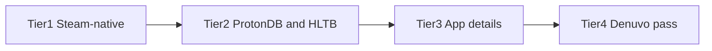

# Scraping and HTTP data sources

Server-side data uses public APIs, `fetch`, and HTML parsing where needed. **No browser automation** in the app.

## What we fetch

| Data | How it is loaded |
| --- | --- |
| Library / wishlist / achievements | Steam Web API (`STEAM_API_KEY`) |
| Windows / Linux / Mac (Library & Mac page) | Steam store app details → `platforms.*` |
| ProtonDB | ProtonDB API |
| HowLongToBeat | HLTB client |
| AWACY anti-cheat | Public JSON |
| Levvvel kernel list | `fetch` + HTML parse |
| Denuvo anti-tamper catalog | Steam Store curator AJAX |
| SteamDB calculator | **External link** on Overview — no server scrape ([`calculator-url.ts`](../src/lib/steamdb/calculator-url.ts)) |

Mac in the UI comes from **`platforms.mac`** in app details (not a separate macOS scrape).

## Platforms in your library

**App details** run after import/refresh (`app_details` job), from Data Status, or `pnpm bootstrap`. Stores `platforms.windows`, `platforms.linux`, `platforms.mac`.

- **Library** OS column: app details only
- **Mac Support** page: `platforms.mac === true`

Needs `STEAM_API_KEY` and `DATABASE_URL` only.

## Global catalogs (AWACY / Levvvel / Denuvo)

**Instance-wide** tables, not per profile. Filled automatically on a fresh DB:

- **Docker:** after migrate, [`docker/entrypoint.sh`](../docker/entrypoint.sh) → `bootstrap-anticheat-catalogs.ts`
- **Server start:** [`instrumentation.ts`](../src/instrumentation.ts) if still empty
- **After import:** background bootstrap if missing

Manual refresh: Data Status. Disable auto: `SLM_SKIP_CATALOG_BOOTSTRAP=true`.

Denuvo catalog: [`fetch-denuvo-curator-catalog.ts`](../src/lib/steam/fetch-denuvo-curator-catalog.ts) via `ajaxgetcuratorrecommendations`.

## Global vs per-appid

| Layer | Tables | Scope |
| --- | --- | --- |
| **Global catalogs** | `awacy_catalog`, `levvvel_catalog`, `denuvo_catalog` | One copy for the whole instance |
| **Per-appid cache** | `steam_app_details`, `protondb_entries`, `howlongtobeat_entries`, `anticheat_entries`, `achievement_stats` | Keyed by **appid**, shared across profiles |

Jobs enqueue only for **your** profile’s appids (or compare warmup scope). If two profiles own appid `570`, the second reuses cached rows within TTL. Targets resolved in [`resolve-enrichment-appids.ts`](../src/lib/enrichment/resolve-enrichment-appids.ts).

**Not built:** full Steam catalog scrape — only appids from imported libraries (or compare scope) are enriched.

WAL, TTL, and DB size: [database.md § Caching](./database.md#caching).

## Job pipeline order

1. **Steam-native (fast):** `anticheat_catalog`, `wishlist`, `achievements`, `anticheat` (catalog match from SQLite)
2. **Third-party (batched):** `protondb`, `hltb` (HLTB only on full sync, delayed by `SLM_HLTB_SYNC_DELAY_MS`)
3. **Heavy store:** `app_details` (platforms / Deck compat)
4. **Denuvo pass:** second phase of `anticheat` (store HTML, deferred)

Worker uses the same priority and runs batches until the ~50s tick budget. Tunables: [env.md § Background jobs](./env.md#background-jobs) and [batch-config.ts](../src/lib/jobs/batch-config.ts).

**Post-import** auto-enqueues FAST jobs only (no HLTB). **Full sync** (Data Status) queues HLTB with `runAfter`.

## Compare warmup

Compare shows games in **every** selected profile (intersection). Columns read SQLite only — no live third-party fetches on render.

| Endpoint | Purpose |
| --- | --- |
| `POST /api/dashboard/{ownerSteamid}/warmup` | Body `{ steamids, missingOnly?, force?, kinds? }` — union libraries, enqueue scoped jobs. Returns `{ jobs: [{ kind, id, status }] }`. |
| `GET /api/dashboard/{ownerSteamid}/compare-status?compareIds=…` | `{ intersectAppids, unionAppids, coverage, activeJobs }`. Coverage uses **intersect** appids. |

- Max **4** steamids (owner + 3 compare profiles)
- UI banner polls compare-status every 5s while jobs run
- **Refresh compare data** triggers warmup manually
- Auto warmup on load: `NEXT_PUBLIC_SLM_COMPARE_AUTO_WARMUP=true` at build time (default off)

## Scripts

`scripts/` use the same HTTP stack as the app — no browser required.
